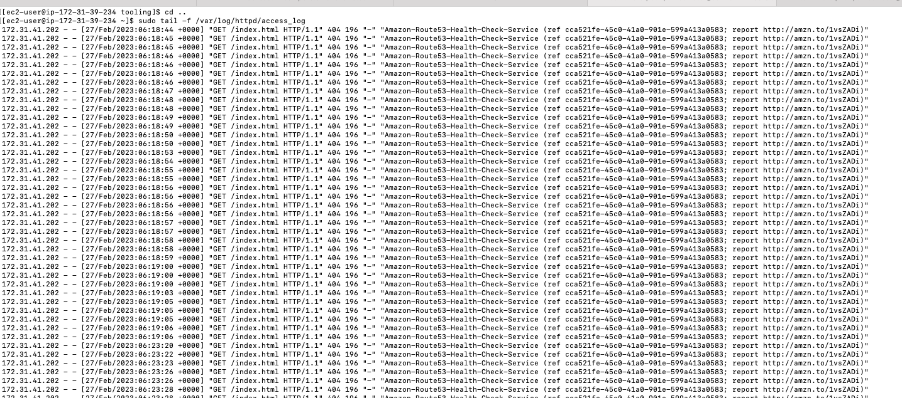
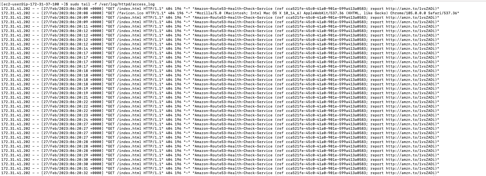

## Project 8: Load Balancer Solution with Apache

1. Configure Ubuntu Server 

2. Open TCP port 80 on Project-8-apache-lb by creating an Inbound Rule in Security Group.

3. Install Apache Load Balancer on Project-8-apache-lb server and configure it to point traffic coming to LB to both Web Servers

'#Install apache2
sudo apt update
sudo apt install apache2 -y
sudo apt-get install libxml2-dev

#Enable following modules:

'sudo a2enmod rewrite'

'sudo a2enmod proxy'

sudo a2enmod proxy_balancer'

'sudo a2enmod proxy_http'

'sudo a2enmod headers'

'sudo a2enmod lbmethod_bytraffic'

'sudo systemctl restart apache2'

- Configure load balancing

4. Verify that our configuration works – try to access your LB’s public IP address or Public DNS name from your browser:

- Optional Step – Configure Local DNS Names Resolution

